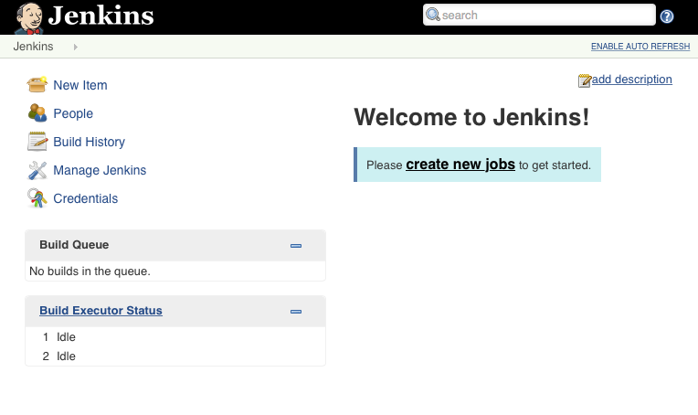
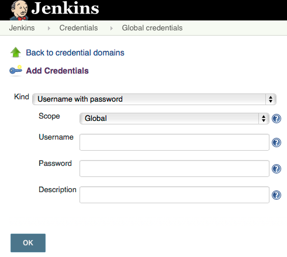

Continuous Integration
========================

.. |JetBrains| unicode:: JetBrains U+2122

.. |Team City| unicode:: Team City U+2122 .. trademark sign

.. |Jenkins| replace:: Jenkins

.. note:: 
	All of this is copied from our notes on Trello.

	Good things to cover: - Testing with or without a database.
	- Scaling CI to 10s or 100s of developers
	- I/O tests vs scalability
	- Importance of having a componentized architecture and doing smaller builds / test runs
	- Automated GUI testing systems.

	Another area important to cover here is periodically failing unit tests. A test that throws up a false positive at a 0.5% rate will cause a lot of headaches when there are thousands of unit tests and hundreds of builds each day.

	CI systems that serve 20 or more developers tend to be distributed systems. The same problems that exist in distributed systems exist in CI systems, but some are unique. It would be a good idea to cover hardware / network considerations along with how I/O is managed.

In this chapter, we will discuss your choices for establishing an effective continuous integration system for your Scala Software. We will explore how to best configure a continuous integration server for two different continuous integration products. We will also explore best practices for writing unit tests to minimize false positives in your automated testing.

Continuous Integration Products
-------------------------------

The two products we will present in this chapter are |JetBrains|, |Team City| and |Jenkins|. |Team City| is developed by the same company that develops IntelliJ IDEA and other products in the Java eco-system. |Jenkins| is an award winning product that has a long history with the Java community. Both are good options for implementing a continuous integration system.

Team City
---------

.. todo:: installation walkthrough

.. todo:: build configuration

.. todo:: build results notification

.. todo:: IntelliJ IDEA plugin

Jenkins
-------

Installation
~~~~~~~~~~~~

First you will need to install Jenkins. The following instructions are for Ubuntu. The first step is to install the Jenkins package.

.. code-block:: shell

	$ wget -q -O - https://jenkins-ci.org/debian/jenkins-ci.org.key | sudo apt-key add -
	$ sudo sh -c 'echo deb http://pkg.jenkins-ci.org/debian binary/' > /etc/apt/sources.list.d/jenkins.list'
	$ sudo apt-get update
	$ sudo apt-get install jenkins

Configuring Security
~~~~~~~~~~~~~~~~~~~~

After this step you should be able to log into your jenkins server. Next we will add a user that can log into Jenkins. To do this, you will open the ``Jenkins`` menu and click on ``Credentials``. On the next screen you will select Global Credentials and then add credentials.

Next you will have to setup security. To do this, click on the ``Jenkins`` menu and click ``Manage Jenkins``. You will be presented with a screen where you can click ``Setup Security``. On this screen, for demo purposes we will select ``Logged-in users can do anything`` and ``Jenkins' own user database``

.. image:: images/ci/Jenkins_manage_setup_security.png
	:width: 60%

.. image:: images/ci/Jenkins_global_security.png
	:width: 60%

After configuring security, you can begin to create users. At the homepage, you can click on ``Sign Up`` on the upper-right hand of the page.

Adding Build Configurations
~~~~~~~~~~~~~~~~~~~~~~~~~~~

.. todo:: build configuration

.. todo:: build results notification

.. todo:: scala plugin installation

.. todo:: plugin based build vs. scripted build vs. build system stability

.. todo:: IntelliJ IDEA plugin

Scaling Continuous Integration
------------------------------

Many build systems and test frameworks are single threaded systems. With modern servers that have multiple cores and RAID based storage systems that support parallel I/O, build servers are often under utilized. 

A demonstration of this can be seen with a compilation of the Linux kernel. In this test, a system with 24 logical cores and a RAID-10 SSD storage system was used. A test was performed with one, two, four, and six virtual machines with four virtual cores each. Each VM ran a single build of the Linux kernel. In the figure below, we can see that there is no noticable difference between having one build server and having two. Also, performance only decreases by about 20% when the VM count is increased to four VMs. A greater loss of performance of about 40% occurs with six virtual machines.

.. figure:: images/ci/build_perf.png
	:width: 50%

We recommend that when scaling your continuous integration system to include more build servers, to consider the current utilization of the existing physical servers. In many cases, modern hardware is able to support more than one build server per physical server.

.. todo:: Shared storage and build artifact management

.. todo:: deploying 3rd party technologies. centralized vs on each build server vs licensing costs

Continuous Integration Frequency
--------------------------------

.. todo:: Not all tests need to be run every time. Quick tests vs. slower tests

.. todo:: Nightly automated regression tests

.. todo:: Frequency of build vs. size of component

.. todo:: Agile development. Check in early, often.

Continuous Integration and Third Party Technologies
---------------------------------------------------

.. todo:: Testing with the database vs. not testing with the database.

.. todo:: artifact management, componentized software and incremental building

False Positives and Periodic Failure in Test Automation
-------------------------------------------------------

.. todo:: false positives due to scaling. the 10x scaling rule. 3rd party technology reliability

.. todo:: false positives due to scaling vs production scaling

.. todo:: false positives due to timeouts (somewhat related to scaling)

.. todo:: false positives due to time-sensitive or order sensitive assertions

