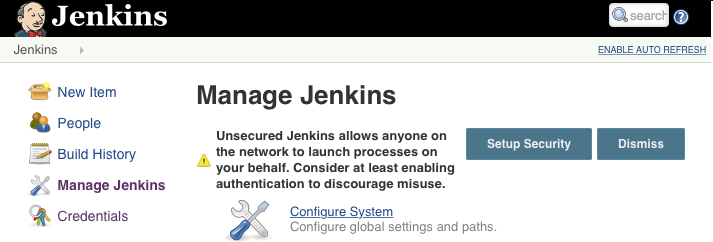
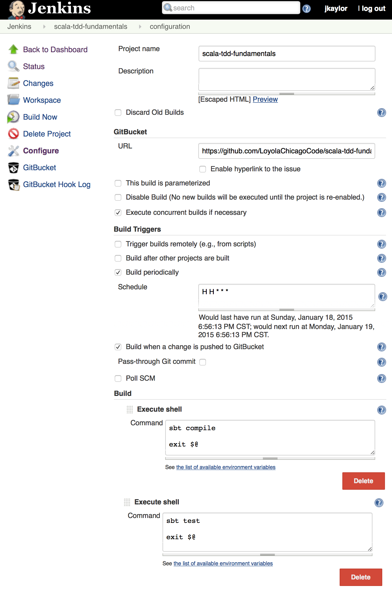

Continuous Integration
========================

.. |JetBrains| unicode:: JetBrains U+2122

.. |Team City| unicode:: Team City U+2122 .. trademark sign

.. |Jenkins| replace:: Jenkins

.. note:: 
	All of this is copied from our notes on Trello.

	Good things to cover: - Testing with or without a database.
	- Scaling CI to 10s or 100s of developers
	- I/O tests vs scalability
	- Importance of having a componentized architecture and doing smaller builds / test runs
	- Automated GUI testing systems.

	Another area important to cover here is periodically failing unit tests. A test that throws up a false positive at a 0.5% rate will cause a lot of headaches when there are thousands of unit tests and hundreds of builds each day.

	CI systems that serve 20 or more developers tend to be distributed systems. The same problems that exist in distributed systems exist in CI systems, but some are unique. It would be a good idea to cover hardware / network considerations along with how I/O is managed.

In this chapter, we will discuss your choices for establishing an effective continuous integration system for your Scala Software. We will explore how to best configure a continuous integration server for two different continuous integration products. We will also explore best practices for writing unit tests to minimize false positives in your automated testing.

Continuous Integration Products
-------------------------------

The two products we will present in this chapter are |JetBrains|, |Team City| and |Jenkins|. |Team City| is developed by the same company that develops IntelliJ IDEA and other products in the Java eco-system. |Jenkins| is an award winning product that has a long history with the Java community. Both are good options for implementing a continuous integration system.

Team City
---------

.. todo:: installation walkthrough

.. todo:: build configuration

.. todo:: build results notification

.. todo:: IntelliJ IDEA plugin

Jenkins
-------

Installation
~~~~~~~~~~~~

First you will need to install Jenkins. The following instructions are for Ubuntu. The first step is to install the Jenkins package.

.. code-block:: shell

	$ wget -q -O - https://jenkins-ci.org/debian/jenkins-ci.org.key | sudo apt-key add -
	$ sudo sh -c 'echo deb http://pkg.jenkins-ci.org/debian binary/' > /etc/apt/sources.list.d/jenkins.list'
	$ sudo apt-get update
	$ sudo apt-get install jenkins

Configuring Security
~~~~~~~~~~~~~~~~~~~~

After this step you should be able to log into your jenkins server. Next we will add a user that can log into Jenkins. To do this, you will open the ``Jenkins`` menu and click on ``Credentials``. On the next screen you will select Global Credentials and then add credentials.

.. image:: images/ci/Jenkins_Installed.png
	:width: 60%

.. image:: images/ci/Jenkins_add_user.png
	:width: 60%

Next you will have to setup security. To do this, click on the ``Jenkins`` menu and click ``Manage Jenkins``. You will be presented with a screen where you can click ``Setup Security``. On this screen, for demo purposes we will select ``Logged-in users can do anything`` and ``Jenkins' own user database``

.. image:: images/ci/Jenkins_global_security.png
	:width: 60%

After configuring security, you can begin to create users. At the homepage, you can click on ``Sign Up`` on the upper-right hand of the page.

Adding Build Configurations
~~~~~~~~~~~~~~~~~~~~~~~~~~~

After you log into Jenkins, you will be able to click ``Create Item``. From this page you will be able to create a new build configuration. An example of the scala-tdd-fundamentals build configuration can be seen below. In this example, we're using GitHub so we've installed the GitBucket plugin into Jenkins.

After you have saved this configuration, Jenkins will be able to watch your version control system for changes, perform builds, and run all of your unit tests on each checkin. Everyone working on the software will be able to see that all of the changes that are checked in, that they compile, and that tests pass.

.. todo:: IntelliJ IDEA plugin

Scaling Continuous Integration
------------------------------

Many build systems and test frameworks are single threaded systems. With modern servers that have multiple cores and RAID based storage systems that support parallel I/O, build servers are often under utilized. 

A demonstration of this can be seen with a compilation of the Linux kernel. In this test, a system with 24 logical cores and a RAID-10 SSD storage system was used. A test was performed with one, two, four, and six virtual machines with four virtual cores each. Each VM ran a single build of the Linux kernel. In the figure below, we can see that there is no noticable difference between having one build server and having two. Also, performance only decreases by about 20% when the VM count is increased to four VMs. A greater loss of performance of about 40% occurs with six virtual machines.

.. figure:: images/ci/build_perf.png
	:width: 50%

We recommend that when scaling your continuous integration system to include more build servers, to consider the current utilization of the existing physical servers. In many cases, modern hardware is able to support more than one build server per physical server.

.. todo:: Shared storage and build artifact management

.. todo:: deploying 3rd party technologies. centralized vs on each build server vs licensing costs

Continuous Integration Frequency
--------------------------------

Tests have different execution performance and purpose. Some tests execute quickly and verify one unit of code. Other tests execute more slowly and cover a larger segment of code. Still other tests will involve third party technologies such as web services or databases. All of these tests are important to run in your continuous integration system, but some of these types of tests have challenges that must be addressed.

For this discussion, we divide unit tests into three categories. The first category is tests that are computationally or memory bound. The second category are I/O bound tests and tests that interact heavily with operating system services. The third category of tests are those that work with third party technology and database systems.

An important goal for a continuous integration system is achieve rapid and continuous feedback for project contributors. Running tests with larger run times, tests that don't scale well on the continuous integration system, or tests that have false positive failures interfere with this goal. Of the three categories mentioned above, tests that are computationally and/or memory bound are an excellent fit for this case. On modern systems, computational and memory performance scale quite well. As a suite of tests grows, performance for such tests should remain reasonable.

The two other categories: I/O bound tests and tests involving third party technologies are a bit more complex to consider. For I/O bound tests it is important to consider issues of scale. If several hundred tests that are I/O bound run on a continuous integration system that supports 25 developers with a team average of 75 checkins per day, it does not take much to be running around several hundred thousand I/O bound tests in a day. These tests will often cause builds to queue in a continous integration system and work against the goal of getting rapid feedback. 

For the third category, tests that interact with third party technologies and database systems, there are additional considerations. The first consideration is the issue of periodic failures in third party technologies. Many third party systems have per-call failure rates of 0.1%. Most mature software will build in code aroudn these technologies to react to failures and intelligently retry requests. In a production environment this approach is typically sufficient. In continuous integration, you may experience a different level of scaling. For example, your production software might make occasional requests to a third party web service. To provide coverage to this code, you might write 20 or 30 unit tests to make sure your usage of this service is consistent with its behavior. When run in a continuous integration environment, these 20 or 30 unit tests could translate to tens or even a few hundreds of calls to the service over a short duration. With other builds running in parallel in the continuous integration system, the third party service may experience bursts of several hundred requests in a short period of time when it was only designed for tens of requests for production. When services like these don't scale up, they can create difficult to reproduce false positive failures in your continuous builds.

So, what's the solution for these two categories? Our recommended solution is to put these tests into a continuously running rolling build instead of a per-checkin build that faster tests run in. Such a build could be triggered every thirty minutes, or be queued each time the previous one completes. The advantage to this approach is that it places an upper limit on the number of tests making use of I/O and/or third party technologies in a frame of time. Whether 10 checkins were made or 1 checkin was made in the last thirty minutes, the same number of slower running tests will be run regardless. This approach reduces the load put on third party services and on the continuous integration system in general. Also, by running these tests continuously, you will be able to see results from these tests several times a day.

False Positives and Periodic Failure in Computationally or Memory Bound Tests
-----------------------------------------------------------------------------

In computationally and/or memory bound tests, there are a few categories of priodic failures that need to be considered. These categories include tests that involve time, multi-threading, and the order stability of collections and results from computations.

