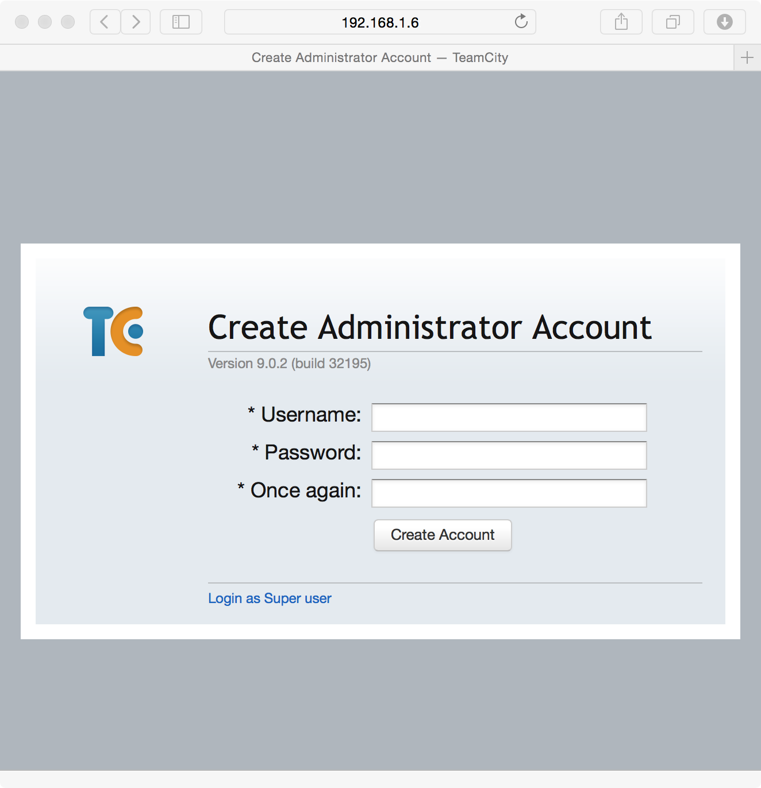
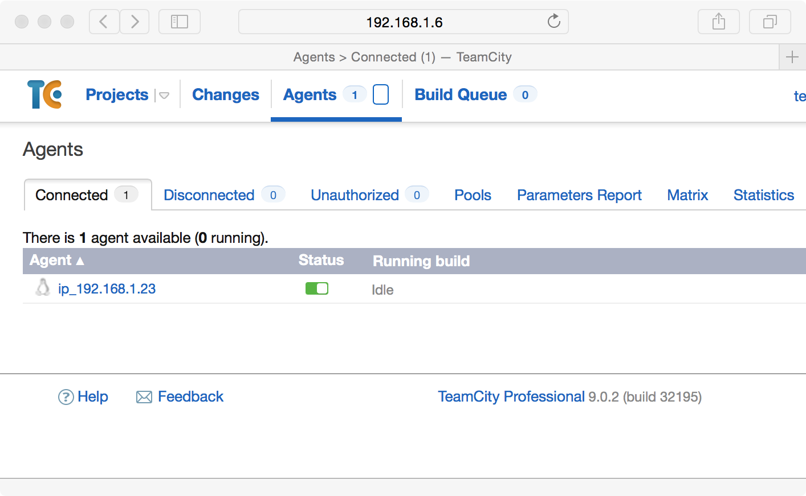
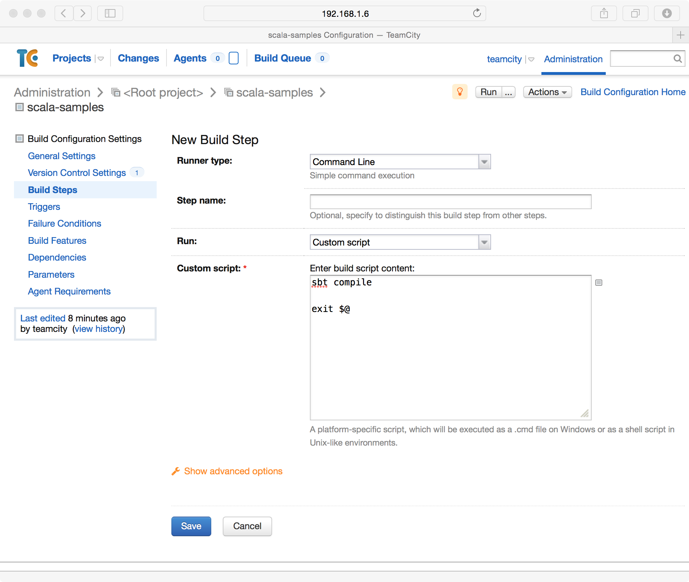
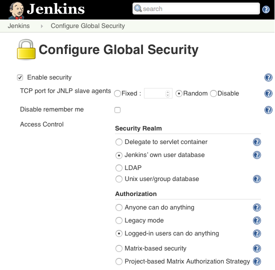

Continuous Integration
========================

.. |JetBrains| unicode:: JetBrains U+2122

.. |Team City| unicode:: Team City U+2122 .. trademark sign

.. |Jenkins| replace:: Jenkins

.. |Git Hub| replace:: Git Hub

In this chapter, we will discuss your choices for establishing an effective continuous integration system for your Scala Software. We will explore how to best configure a continuous integration server for two different continuous integration products. We will also explore best practices for writing unit tests to minimize false positives in your automated testing.

Continuous Integration Products
-------------------------------

The two products we will present in this chapter are |JetBrains|, |Team City| and |Jenkins|. |Team City| is developed by the same company that develops IntelliJ IDEA and other products in the Java eco-system. |Jenkins| is an award winning product that has a long history with the Java community. Both are good options for implementing a continuous integration system.

Team City
---------

Installation
~~~~~~~~~~~~

First you will need to install |Team City|. The following instructions are for Ubuntu. You will need to install the OpenJDK package from the ubuntu package manager as a prerequisite.

.. code-block:: shell

	$ wget http://download.jetbrains.com/teamcity/TeamCity-9.0.2.tar.gz
	$ tar -xzf TeamCity-9.0.2.tar.gz

Then, to configure |Team City| to launch on startup, you can save the following script into the /etc/init.d folder with the file name ``teamcity``. This script assumes you are going to run the server under the user account also named ``teamcity``:

.. code-block:: shell

	#!/bin/bash
	case $1 in 
	start)
		cd /home/teamcity/TeamCity/bin
		su teamcity -c "./teamcity-server.sh start"
	;;
	stop)
		PID=`ps aux | gawk '{printf("%s %s\n", $1, $2);}' | grep -i "teamcity" | gawk '{printf("%s\n", $2);}'`
		kill $PID
	;;
	esac

After creating this script, you can run the following command to configure Ubuntu to start |Team City| on startup.

.. code-block:: shell

	$ sudo chmod +x /etc/init.d/teamcity
	$ sudo update-rc.d teamcity defaults

Then, after rebooting the server, you should have a working installation of |Team City|. You can access the server at http://server:8111/

Initial Configuration
~~~~~~~~~~~~~~~~~~~~~

After the initial installation, you will need to perform some configuration for security and the |Team City| server database. Start by directing your browser to your |Team City| isntallation. You will be first asked for where your local data directory will be stored. This will be a folder where configuration settings will be stored and should be regularly backed up.

.. image:: images/ci/tc/01.png
	:width: 60%

On the next page, you will select your database provider. If your site only has a few developers, HSQLDB will suffice, but if you are planning on supporting more than 10 developers, one of the other database providers is recommended. 

.. image:: images/ci/tc/02.png
	:width: 60%

After you select your provider, you will have to accept the |Team City| license agreement. On the following page, you will be able to create an Administrator account for |Team City|. 

Installing a Build Agent
~~~~~~~~~~~~~~~~~~~~~~~~

To install a build agent on Ubuntu, you will need to have the Java runtime and Scala SBT installed as prerequisites. The following code snippit shows how to download and install a |Team City| build agent.

.. code-block:: shell

	$ mkdir TeamCityBuildAgent
	$ cd TeamCityBuildAgent
	$ wget http://server:8111/update/buildAgent.zip
	$ unzip buildAgent.zip
	$ cd bin
	$ chmod +x install.sh
	$ ./install.sh http://server:8111

To enable the build agent on startup, you can create the following script under /etc/init.d/teamcity-buildagent:

.. code-block:: shell

	#!/bin/bash
	case $1 in 
	start)
		cd /home/teamcity/TeamCityBuildAgent/bin
		su teamcity -c "./agent.sh start"
	;;
	stop)
		PID=`ps aux | gawk '{printf("%s %s\n", $1, $2);}' | grep -i "teamcity" | gawk '{printf("%s\n", $2);}'`
		kill $PID
	;;
	esac

After creating the script, you will need to refresh your system services:

.. code-block:: shell

	$ sudo chmod +x /etc/init.d/teamcity-buildagent
	$ sudo update-rc.d teamcity-buildagent defaults

Once the build agent is up and running, you will need to authorize it through the |Team City| site. The agent should show up under the Agents tab and Unauthorized tab. To authorize it, click on ``unauthorize`` and then click ``authorize``. After a few seconds, the build agent should show up under the connected tab.

.. image:: images/ci/tc/agent_01.png
	:width: 60%

.. image:: images/ci/tc/agent_02.png
	:width: 60%

Creating a Project and Build Configuration
~~~~~~~~~~~~~~~~~~~~~~~~~~~~~~~~~~~~~~~~~~

Now you should be able to create projects in |Team City|. |Team City| projects are orginizational concepts that allow you to reuse version control connections, and to control more fine grained permissions. Every build configuration belongs to a project. To create your first project, you will need to log into your |Team City| server and click ``Create project``.

.. image:: images/ci/tc/proj_01.png
	:width: 60%

After creating the project, you will be able to create a build configuration. The free version of |Team City| allows for a maximum of 20 build configurations. To create the build configuration, you will click the ``Create build configuration`` button.

.. image:: images/ci/tc/proj_02.png
	:width: 60%

.. image:: images/ci/tc/proj_03.png
	:width: 60%

After creating the build configuration, you will be asked to supply the version control information for your project. |Team City| supports many of the version control systems available today. Here we will use the book's sample code which is available on |Git Hub|

.. image:: images/ci/tc/proj_04.png
	:width: 60%

The next step will be to create the build script for the project. This script is fairly simple. The exit statement at the end of the script is there to communicate back to the build server whether the previous call to ``sbt`` succeeded or not.

After creating the compilation step, you will next create the step to run all of your unit tests. This script is also very straight forward:

.. image:: images/ci/tc/proj_06.png
	:width: 60%

The final step will be to create build triggers. These can be added to trigger builds every time a change is checked into version control or can be configured to build periodically. Later in this chapter, we will dicuss how to choose between these two.

.. image:: images/ci/tc/proj_07.png
	:width: 60%

.. todo:: agent configuration

Jenkins
-------

Installation
~~~~~~~~~~~~

First you will need to install Jenkins. The following instructions are for Ubuntu. The first step is to install the Jenkins package.

.. code-block:: shell

	$ wget -q -O - https://jenkins-ci.org/debian/jenkins-ci.org.key | sudo apt-key add -
	$ sudo sh -c 'echo deb http://pkg.jenkins-ci.org/debian binary/' > /etc/apt/sources.list.d/jenkins.list'
	$ sudo apt-get update
	$ sudo apt-get install jenkins

Configuring Security
~~~~~~~~~~~~~~~~~~~~

After this step you should be able to log into your jenkins server. Next we will add a user that can log into Jenkins. To do this, you will open the ``Jenkins`` menu and click on ``Credentials``. On the next screen you will select Global Credentials and then add credentials.

.. image:: images/ci/Jenkins_Installed.png
	:width: 60%

.. image:: images/ci/Jenkins_add_user.png
	:width: 60%

Next you will have to setup security. To do this, click on the ``Jenkins`` menu and click ``Manage Jenkins``. You will be presented with a screen where you can click ``Setup Security``. On this screen, for demo purposes we will select ``Logged-in users can do anything`` and ``Jenkins' own user database``

.. image:: images/ci/Jenkins_manage_setup_security.png
	:width: 60%

After configuring security, you can begin to create users. At the homepage, you can click on ``Sign Up`` on the upper-right hand of the page.

Adding Build Configurations
~~~~~~~~~~~~~~~~~~~~~~~~~~~

After you log into Jenkins, you will be able to click ``Create Item``. From this page you will be able to create a new build configuration. An example of the scala-tdd-fundamentals build configuration can be seen below. In this example, we're using GitHub so we've installed the GitBucket plugin into Jenkins.

.. image:: images/ci/Jenkins_build_config.png
	:width: 60%

After you have saved this configuration, Jenkins will be able to watch your version control system for changes, perform builds, and run all of your unit tests on each checkin. Everyone working on the software will be able to see that all of the changes that are checked in, that they compile, and that tests pass.

.. todo:: IntelliJ IDEA plugin

Scaling Continuous Integration
------------------------------

Many build systems and test frameworks are single threaded systems. With modern servers that have multiple cores and RAID based storage systems that support parallel I/O, build servers are often under utilized. 

A demonstration of this can be seen with a compilation of the Linux kernel. In this test, a system with 24 logical cores and a RAID-10 SSD storage system was used. A test was performed with one, two, four, and six virtual machines with four virtual cores each. Each VM ran a single build of the Linux kernel. In the figure below, we can see that there is no noticable difference between having one build server and having two. Also, performance only decreases by about 20% when the VM count is increased to four VMs. A greater loss of performance of about 40% occurs with six virtual machines.

.. disabling for now
.. figure images/ci/build_perf.png :width: 50%

We recommend that when scaling your continuous integration system to include more build servers, to consider the current utilization of the existing physical servers. In many cases, modern hardware is able to support more than one build server per physical server.

Continuous Integration Frequency
--------------------------------

Tests have different execution performance and purpose. Some tests execute quickly and verify one unit of code. Other tests execute more slowly and cover a larger segment of code. Still other tests will involve third party technologies such as web services or databases. All of these tests are important to run in your continuous integration system, but some of these types of tests have challenges that must be addressed.

For this discussion, we divide unit tests into three categories. The first category is tests that are computationally or memory bound. The second category are I/O bound tests and tests that interact heavily with operating system services. The third category of tests are those that work with third party technology and database systems.

An important goal for a continuous integration system is achieve rapid and continuous feedback for project contributors. Running tests with larger run times, tests that don't scale well on the continuous integration system, or tests that have false positive failures interfere with this goal. Of the three categories mentioned above, tests that are computationally and/or memory bound are an excellent fit for this case. On modern systems, computational and memory performance scale quite well. As a suite of tests grows, performance for such tests should remain reasonable.

The two other categories: I/O bound tests and tests involving third party technologies are a bit more complex to consider. For I/O bound tests it is important to consider issues of scale. If several hundred tests that are I/O bound run on a continuous integration system that supports 25 developers with a team average of 75 checkins per day, it does not take much to be running around several hundred thousand I/O bound tests in a day. These tests will often cause builds to queue in a continous integration system and work against the goal of getting rapid feedback. 

For the third category, tests that interact with third party technologies and database systems, there are additional considerations. The first consideration is the issue of periodic failures in third party technologies. Many third party systems have per-call failure rates of 0.1%. Most mature software will build in code aroudn these technologies to react to failures and intelligently retry requests. In a production environment this approach is typically sufficient. In continuous integration, you may experience a different level of scaling. For example, your production software might make occasional requests to a third party web service. To provide coverage to this code, you might write 20 or 30 unit tests to make sure your usage of this service is consistent with its behavior. When run in a continuous integration environment, these 20 or 30 unit tests could translate to tens or even a few hundreds of calls to the service over a short duration. With other builds running in parallel in the continuous integration system, the third party service may experience bursts of several hundred requests in a short period of time when it was only designed for tens of requests for production. When services like these don't scale up, they can create difficult to reproduce false positive failures in your continuous builds.

So, what's the solution for these two categories? Our recommended solution is to put these tests into a continuously running rolling build instead of a per-checkin build that faster tests run in. Such a build could be triggered every thirty minutes, or be queued each time the previous one completes. The advantage to this approach is that it places an upper limit on the number of tests making use of I/O and/or third party technologies in a frame of time. Whether 10 checkins were made or 1 checkin was made in the last thirty minutes, the same number of slower running tests will be run regardless. This approach reduces the load put on third party services and on the continuous integration system in general. Also, by running these tests continuously, you will be able to see results from these tests several times a day.

False Positives and Periodic Failure in Computationally or Memory Bound Tests
-----------------------------------------------------------------------------

In computationally and/or memory bound tests, there are a few categories of priodic failures that need to be considered. These categories include tests that involve time, multi-threading, and the order stability of collections and results from computations. For each of these categories we will explore ways to write assertions to be tolerant of reasonable differences in individual executions of a unit test.

Order Stability in Tests
~~~~~~~~~~~~~~~~~~~~~~~~

In many languages, and Scala is no exception, there are algorithms that do not preserve order stability. It is not uncommon to see sparse data structures like hash tables, built in sort algorithms, and others inconsistently manage stability. In the construction of algorithms the property of stability is sometimes important. For example, radix sort would not work correctly if its sorting subroutine was not itself a stable sort. 

When making assertions, make sure to note when your test is implying an order and whether that order is truly needed. For example, you may wish to assert that two items are in a list. One approach is to assert that the first element in the list is the first item and the second element in the list is the second item. A second approach is to assert for each item that the item is contained somewhere in the list. This second assertion does not depend on the stability of the algorithm that produces the list.

This kind of behavior is also common for hash tables. When the default hash is the internal or managed memory address of an object, two different runs can produce two separate orders of items in the hash table. Where hashes are more deterministic, this is not the case.

.. todo:: add examples for these kinds of assertions

Multi Threading in Tests
~~~~~~~~~~~~~~~~~~~~~~~~

Writing simple, correct, and efficient multi-threaded code requires a good deal of thought and attention to detail. When problems occur in multi-threaded code, they can be difficult to reproduce or rare to occur. Sometimes, a multi-threaded program will work just fine on a 2-CPU system, but run into trouble when it is put on a 8-CPU system. These kinds of issues are often encountered in a continuous integration environment.

There are often differences between a developer's computer, a customer's computer, and a build server in a continuous integration system. These differences can be seen in the number of processor cores, the sizes of caches, the available memory and the software environment on these systems. Many of these factors can lead to quite different execution timing in multi-threaded code. Sometimes it is the case that a test will fail in continuous integration 10% of the time, but never fail on a developer's machine. These kinds of failures can be quite frustrating to figure out.

There are two important things to consider when testing such code. One is whether or not to test your code in a multi threaded execution environment. It is possible to test its individual components in one thread each to verify each component without assembling them all together for a more integrated test in a multi-threaded environment. There is value in both types of tests. Another consideration is how you respond to failure in the multi-threaded tests that run on the continuous integration environment. A great advantage of these tests running on a continuous integration environment is that they get executed often. So, multi-threading problems that will only reliably occur 0.1% of the time will show up as failures at least a few times over the course of a few days. While this is not the immediate feedback we'd like in continuous builds, it does give us a larger sample size and a larger number of permutations of the multi-threaded execution. The longer a test is running successfully, the more confident we can be in the correctness of our programs.

Tests and Code Concerning Time
~~~~~~~~~~~~~~~~~~~~~~~~~~~~~~

In your application you may need to interact with library functions to retreive the current clock time from the operating system. When this type of code is tested, there are some special considerations to make. Before proceeding, it is important to discuss the behavior of clocks on different systems. One example is the difference between the scheduler quantumn on server and client operating systems. Often it is the case that the scheduler quantumn is longer, on the order of 100ms, for server operating systems, and is much shorter on mobile devices, and destktop computers, typically on the order of 10-20ms. When the time is retreived from the operating system, if there is other code that makes a call to the operating system before your assertions, there can be differing behavior on user system sand server systems. 

For example, you may be able to assert that a recently retreived time value is the same as a subsequently retreived time value and get get a positive result 99% of the time on a desktop system. However, when the timing changes on a server system, which may be the system you're using in your continuous integration system, these assertions may break down.

When possible, it is a best practice to work with fixed time values in your tests. If you can pass into your code under test a fixed time value, then you can be sure that your tests' assertions will always be valid.

